# My-Notes
This Notes application is built using material design language and Database used in this application is Room Database that is provided by Google in android Os 
by default and is supported by android studio natively.
You can add pictures to your notes application from the gallery of your android device
I also have the ability to pull out text from the images that are added in the notes (text recognintion using ML kit)
You can also add links from the web to your notes in this notes application

NOTE:- I used ROOM database in this application provided and recommended by Google

All the preview pictures are shown below:->

Splash screen:
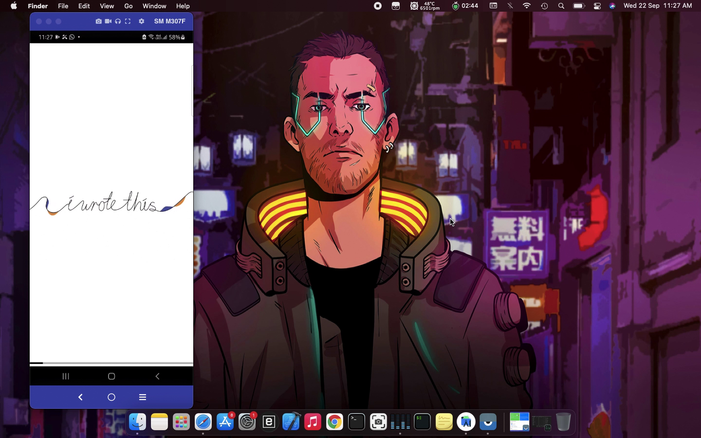

Note's List Activity:
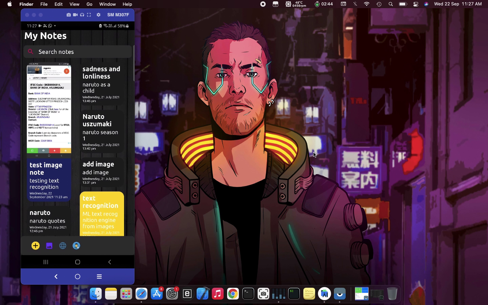

Bottom swipe menu:
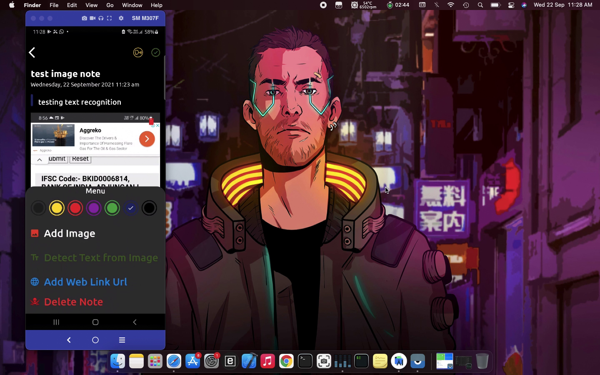

Delete Note opearation:
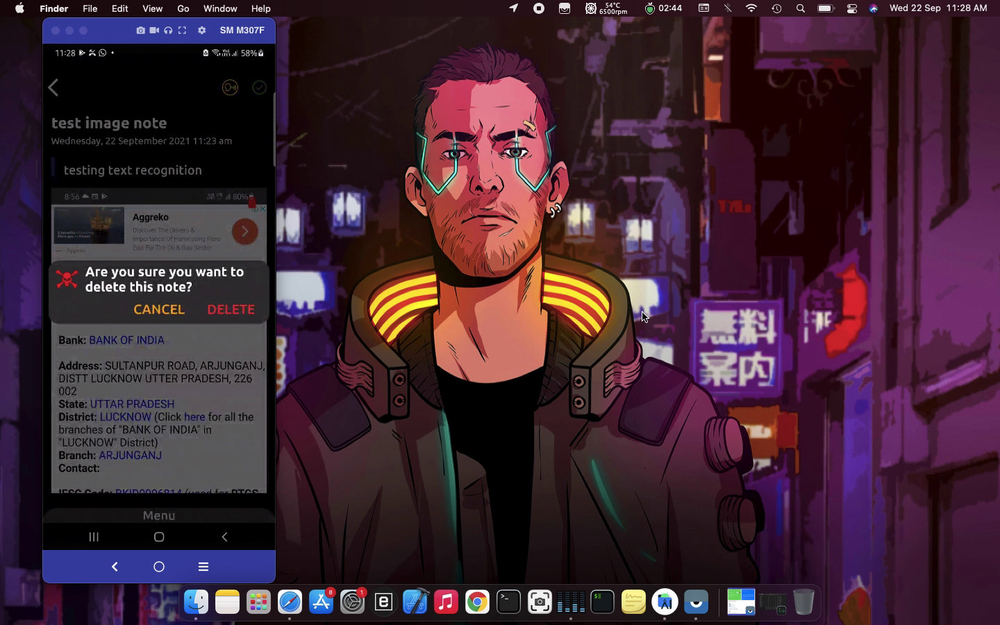

Add Note operation:
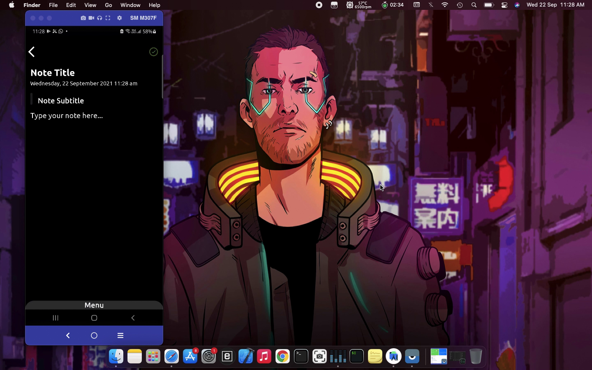

Tesing add note along with image from the device's gallery:
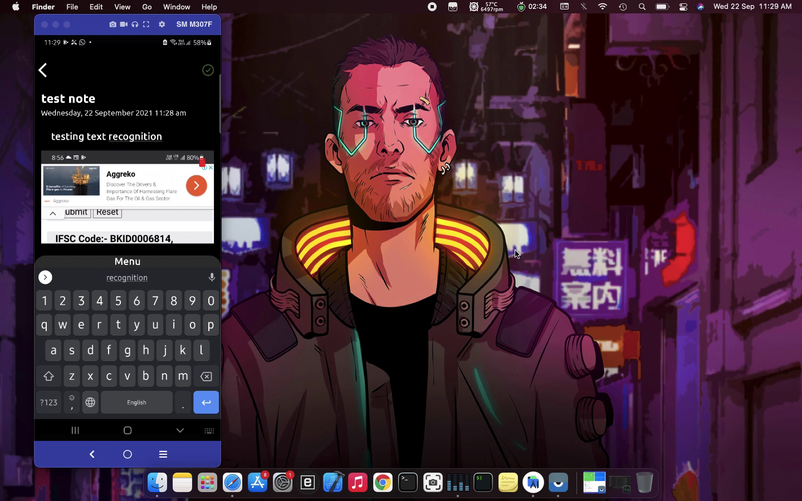
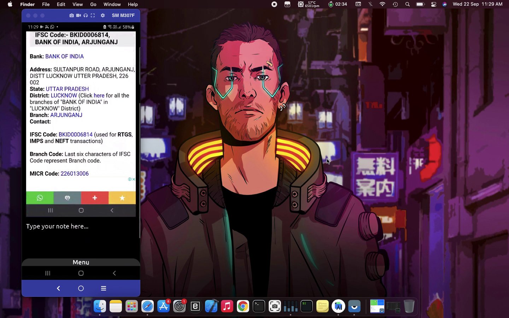

Now from the swipe up menu selecting Detect Text From image option:

The Detected text from the image will be automatically added to the Note's body:
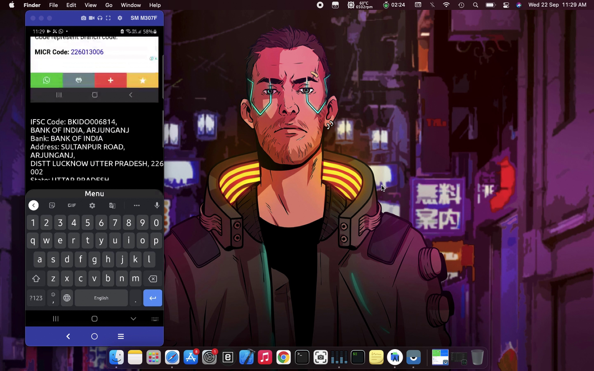
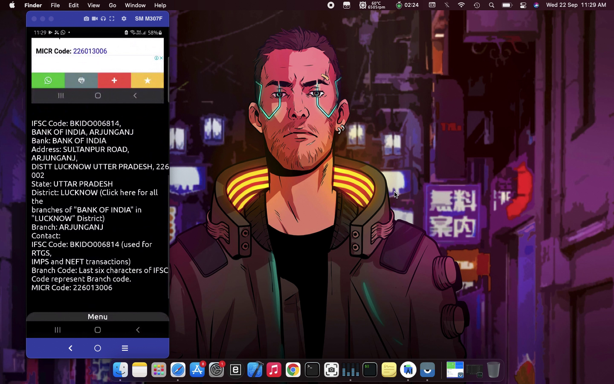

Developer page:
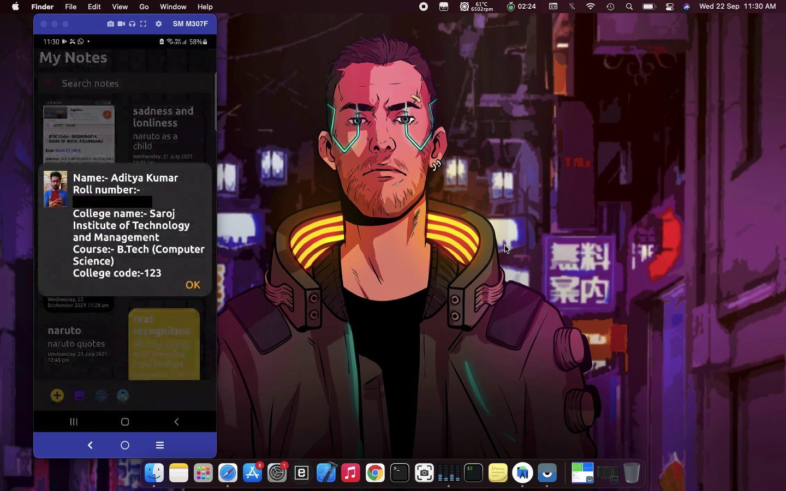

Add url from the web to your notes:
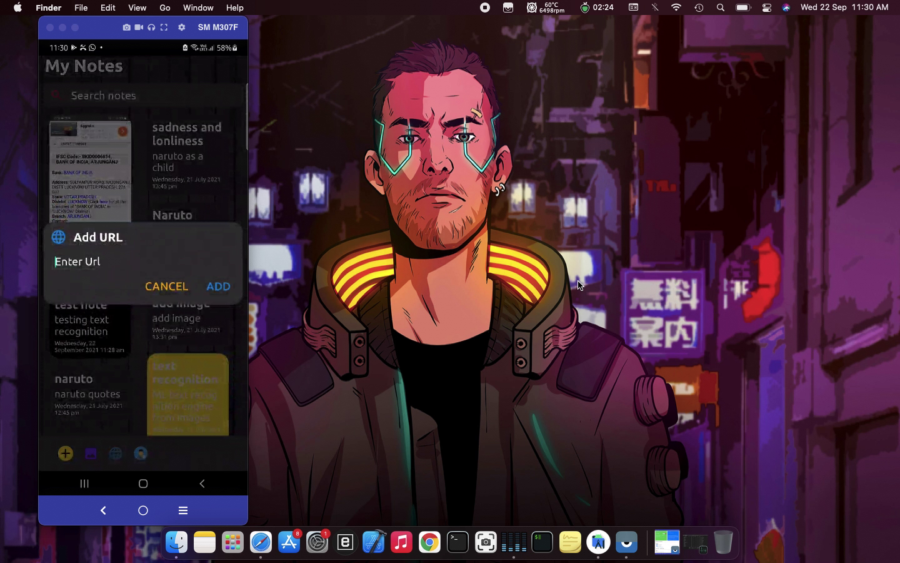

You also have search functionality to search your notes from the list of notes in the app:
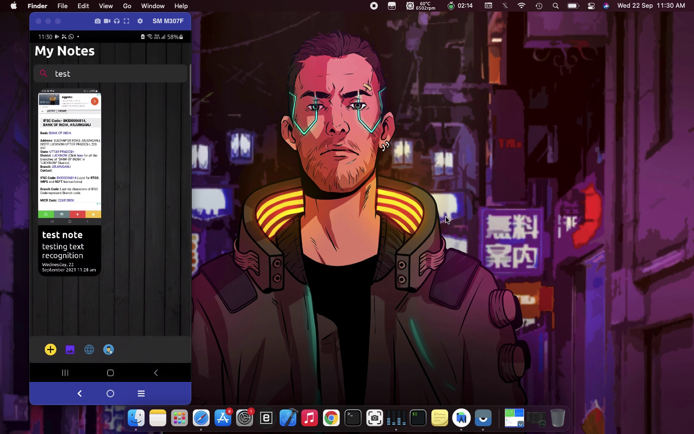
