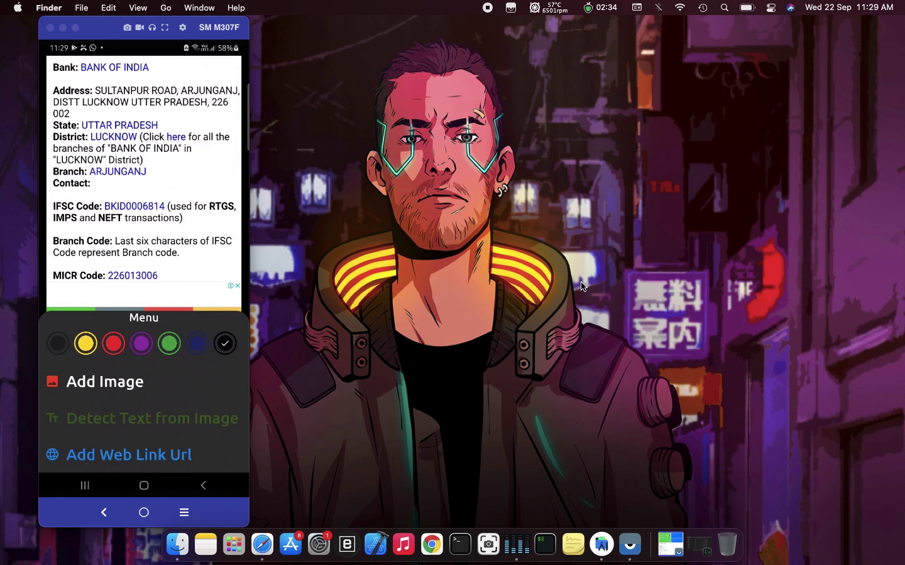

# My-Notes
This Notes application is built using material design language and Database used in this application is Room Database that is provided by Google in android Os 
by default and is supported by android studio natively.
You can add pictures to your notes application from the gallery of your android device
I also have the ability to pull out text from the images that are added in the notes (text recognintion using ML kit)
You can also add links from the web to your notes in this notes application

All the preview pictures are shown below:->

Splash screen:
 
